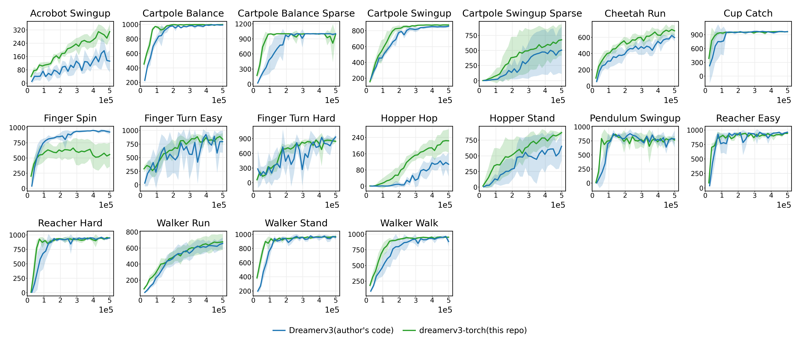
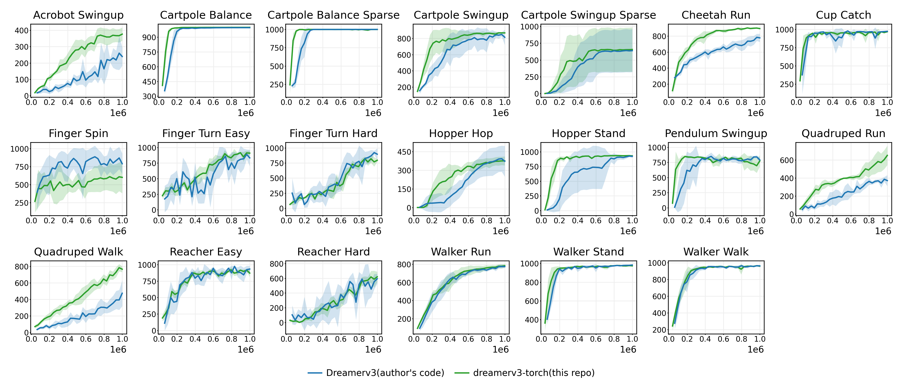
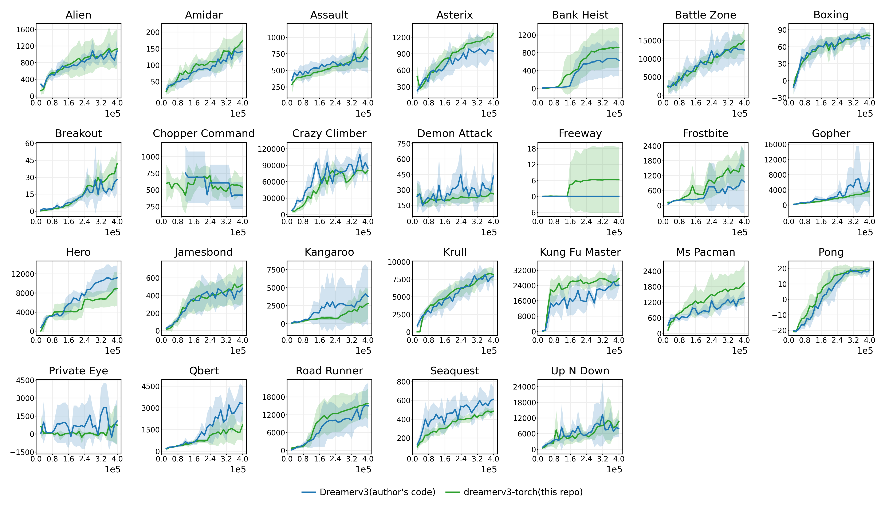

# dreamerv3-torch
Pytorch implementation of [Mastering Diverse Domains through World Models](https://arxiv.org/abs/2301.04104v1). DreamerV3 is a scalable algorithm that outperforms previous approaches across various domains with fixed hyperparameters.

## Instructions

### Method 1: Manual

Get dependencies with python 3.11:
```
pip install -r requirements.txt
```
Run training on DMC Vision:
```
python3 dreamer.py --configs dmc_vision --task dmc_walker_walk --logdir ./logdir/dmc_walker_walk
```
Monitor results:
```
tensorboard --logdir ./logdir
```
To set up Atari or Minecraft environments, please check the scripts located in [env/setup_scripts](https://github.com/NM512/dreamerv3-torch/tree/main/envs/setup_scripts).

### Method 2: Docker

Please refer to the Dockerfile for the instructions, as they are included within.

## Benchmarks
So far, the following benchmarks can be used for testing.
| Environment        | Observation | Action | Budget | Description |
|-------------------|---|---|---|-----------------------|
| [DMC Proprio](https://github.com/deepmind/dm_control) | State | Continuous | 500K | DeepMind Control Suite with low-dimensional inputs. |
| [DMC Vision](https://github.com/deepmind/dm_control) | Image | Continuous |1M| DeepMind Control Suite with high-dimensional images inputs. |
| [Atari 100k](https://github.com/openai/atari-py) | Image | Discrete |400K| 26 Atari games. |
| [Crafter](https://github.com/danijar/crafter) | Image | Discrete |1M| Survival environment to evaluates diverse agent abilities.|
| [Minecraft](https://github.com/minerllabs/minerl) | Image and State |Discrete |100M| Vast 3D open world.|
| [Memory Maze](https://github.com/jurgisp/memory-maze) | Image |Discrete |100M| 3D mazes to evaluate RL agents' long-term memory.|

## Results
#### DMC Proprio

#### DMC Vision

#### Atari 100k


#### Crafter


## Acknowledgments
This code is heavily inspired by the following works:
- danijar's Dreamer-v3 jax implementation: https://github.com/danijar/dreamerv3
- danijar's Dreamer-v2 tensorflow implementation: https://github.com/danijar/dreamerv2
- jsikyoon's Dreamer-v2 pytorch implementation: https://github.com/jsikyoon/dreamer-torch
- RajGhugare19's Dreamer-v2 pytorch implementation: https://github.com/RajGhugare19/dreamerv2
- denisyarats's DrQ-v2 original implementation: https://github.com/facebookresearch/drqv2
